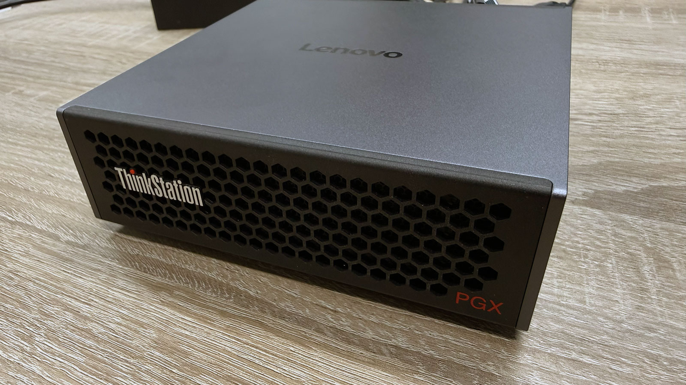

# Local LLM benchmark on NVIDIA GB10 (DGX Spark class)

[](assets/Lenovo-PGX.jpg)

Real, reproducible inference benchmarks for **11 open-weight LLMs** and **10 embedding models** running locally via [Ollama](https://ollama.com) on a single **NVIDIA GB10** (Grace Blackwell, 128 GB unified memory) - a Lenovo ThinkStation PGX, the same silicon as the NVIDIA DGX Spark.

No cloud, no API. Every token was generated on the box. The scripts and raw results are in this repo so you can re-run and check the numbers yourself. It answers the question every client asks - *what can we actually run in-house, without the cloud?* - with measured numbers instead of marketing.

> Measured over a 48-hour hardware loan (thanks to ICT distributor [SWS](https://sws.cz)). Numbers are for the listed Ollama quantizations (Q4_K_M / MXFP4), not full-precision weights.

**Last updated: June 2026** · Ollama 0.24.0 · driver 580 / CUDA 13. Results are snapshot-specific and drift as runtimes and models update.

---

## TL;DR

- **Active parameters decide speed, not total size.** A 35B **MoE** (3B active) does **60 tok/s**; a 128B **dense** model does **2.7 tok/s** on the same box - a ~22× gap. A 120B MoE (gpt-oss) beats a 24B dense model.
- **Long context on dense models is brutal.** At a 128k-token prompt, time-to-first-token is **13 minutes** for a 128B dense model and **7.6 minutes** for 70B dense. MoE models stay in the 1–3 minute range.
- **KV cache is the real memory cost.** A 70B model grows from 43 GB to **102 GB** between chat-length and 128k context. A dense 128B at 128k uses **122 GB** - it nearly fills a 128 GB machine, and OOMs at 256k.
- **Reasoning does not lower your tokens/sec - it just generates more tokens.** Decode rate is identical with reasoning on or off; you wait for more output, not slower output.
- **MoE models keep their speed under long context; dense models collapse.** Nemotron (MoE) holds ~19–21 tok/s from 0.5k to 256k; a dense 128B falls from 2.7 to 0.8 tok/s by 128k.
- **For Czech RAG, multilingual embedders win and small ones are enough.** Snowflake Arctic Embed 2 and BGE-M3 (both ~1.3 GB) match an 8B embedder on Czech retrieval; English-only models fail.

Full per-context tables: [`results/summary-thinkoff.md`](results/summary-thinkoff.md), [`results/summary-thinkon.md`](results/summary-thinkon.md), embeddings in [`results/embed.md`](results/embed.md).

---

## Hardware

|                |                                                                      |
| -------------- | -------------------------------------------------------------------- |
| Device         | Lenovo ThinkStation PGX (NVIDIA GB10, Grace Blackwell)               |
| CPU            | 20-core ARM: 10× Cortex-X925 (≤3.9 GHz) + 10× Cortex-A725 (≤2.8 GHz) |
| Memory         | 128 GB unified (CPU+GPU shared; ~119 GiB usable)                     |
| Driver / CUDA  | 580.159.03 / 13.0                                                    |
| OS             | Ubuntu, kernel 6.17.0-1021-nvidia (aarch64)                          |
| Runtime        | Ollama 0.24.0, Flash Attention **on**, KV cache f16                  |
| Idle GPU power | 11 W (nvidia-smi)                                                    |

## Models tested (generation)

`llama3.1:8b` · `gemma4:e4b` · `gpt-oss:20b` · `mistral-small3.2:24b` · `qwen3.6:27b` · `gemma4:31b` · `qwen3.6:35b-a3b` · `llama3.3:70b` · `gpt-oss:120b` · `mistral-medium-3.5:128b` · `nemotron-3-super:120b`

Contexts: 0.5k, 8k, 32k, 64k, 128k, 256k - each model only run up to its real context limit (no silent truncation).

---

## How fast is each model? (reasoning off)

### Decode throughput at chat length (0.5k prompt)

| Model                      | Type             | Decode tok/s |
| -------------------------- | ---------------- | ------------ |
| Qwen 3.6 35B-A3B           | MoE (3B active)  | **60.2**     |
| gpt-oss 20B                | MoE              | 58.8         |
| Gemma 4 E4B                | edge             | 56.6         |
| Llama 3.1 8B               | dense            | 42.7         |
| gpt-oss 120B               | MoE              | 42.3         |
| Nemotron 3 Super 120B-A12B | MoE (12B active) | 20.6         |
| Mistral Small 3.2 24B      | dense            | 13.9         |
| Qwen 3.6 27B               | dense            | 11.5         |
| Gemma 4 31B                | dense            | 10.3         |
| Llama 3.3 70B              | dense            | 4.9          |
| Mistral Medium 3.5 128B    | dense            | 2.7          |

### Time-to-first-token and memory: 32k vs 128k context

32k is a realistic RAG/agent prompt (a full contract or case file); 128k is the stress extreme.

| Model                   | Type  | TTFT @32k | TTFT @128k         | Mem @32k | Mem @128k |
| ----------------------- | ----- | --------- | ------------------ | -------- | --------- |
| Mistral Medium 3.5 128B | dense | 145 s     | **13 min** (780 s) | 94 GB    | 122 GB    |
| Llama 3.3 70B           | dense | 81 s      | 7.6 min (456 s)    | 57 GB    | 102 GB    |
| Gemma 4 31B             | dense | 40 s      | 195 s              | 28 GB    | 36 GB     |
| Qwen 3.6 27B            | dense | 40 s      | 175 s              | 25 GB    | 32 GB     |
| Nemotron 3 Super 120B   | MoE   | 43 s      | 169 s              | 92 GB    | 93 GB     |
| gpt-oss 120B            | MoE   | 19 s      | 92 s               | 67 GB    | 71 GB     |
| Qwen 3.6 35B-A3B        | MoE   | 17 s      | 75 s               | 27 GB    | 30 GB     |
| Llama 3.1 8B            | dense | 9 s       | 64 s               | 11 GB    | 31 GB     |
| gpt-oss 20B             | MoE   | 8 s       | 43 s               | 15 GB    | 18 GB     |
| Gemma 4 E4B             | edge  | 6 s       | 31 s               | 11 GB    | 13 GB     |

TTFT is real prefill time - prompt caching is defeated (see Methodology). At realistic RAG length (32k) everything answers in seconds to a couple of minutes; at 128k the dense models explode (Mistral Medium 145 s → 13 min) while MoE stays manageable. MoE memory is also nearly flat across context (Nemotron 92 → 93 GB) where dense KV cache balloons (Llama 70B 57 → 102 GB).

### On-disk footprint (Ollama default quant)

Nemotron 120B 86 GB · Mistral Medium 128B 80 GB · gpt-oss 120B 65 GB · Llama 70B 42 GB · Qwen 35B-A3B 23 GB · Gemma 31B 19 GB · Qwen 27B 17 GB · Mistral Small 24B 15 GB · gpt-oss 20B 13 GB · Gemma E4B 9.6 GB · Llama 8B 4.9 GB.

---

## Does reasoning mode reduce tokens/sec?

**No - the decode rate is unchanged. Reasoning just emits more tokens, not slower ones.** The same matrix was run with reasoning enabled (`--think`). Full data: [`results/summary-thinkon.md`](results/summary-thinkon.md).

- **Decode rate is unchanged.** Reasoning emits more tokens; it does not change tokens/sec.
- **Reasoning engaged** for Qwen 3.6 (27B, 35B-A3B), Gemma 4 (E4B, 31B) and Nemotron - output token counts jumped 8–40× (e.g. Qwen 35B-A3B at 128k: 26 → 1021 tokens for the same task).
- **On this retrieval task it added latency with no accuracy benefit** - those models already scored full marks without it.
- **The Ollama `think` boolean is a no-op for gpt-oss** - its output token count did not change. gpt-oss controls reasoning through a *string* effort level (`low`/`medium`/`high`); `true`/`false` is ignored.

---

## gpt-oss long-context retrieval - resolved

A coarse needle test (3 unique facts injected into the prompt, checked in the answer) initially showed gpt-oss scoring 1/3 at long context. **That was a grading artifact, not a retrieval failure.** A dedicated recheck (`recheck_gptoss.py`) across both gpt-oss sizes, all contexts, and all three effort levels shows:

- **Normalized retrieval is 3/3 at every context and every effort level** (0.5k → 128k, low/medium/high). gpt-oss finds all three needles.
- The literal substring grader undercounted it because **gpt-oss formats answers with typographic dashes/markdown** (e.g. it renders the code with a different hyphen), so a strict match caught only the plain-number needle. Normalized matching (lowercase, strip non-alphanumerics) confirms full retrieval.
- Strict-match score *rises* with reasoning effort, because higher effort produces more verbose, structured answers that happen to include the literal string more often.
- One case (`gpt-oss:20b` @32k, high effort) hit the `num_predict` cap mid-reasoning; all three needles were present in the reasoning trace.

Takeaway: **gpt-oss retrieves fine on long context here.** Watch out for (a) the boolean-`think` no-op above, and (b) coarse string graders that penalize formatting rather than measuring retrieval. Full table + raw answers: [`results/gptoss_recheck.md`](results/gptoss_recheck.md).

---

## Which embedding model is best for Czech RAG?

**Several ~1.3 GB multilingual embedders (Snowflake Arctic Embed 2, BGE-M3) handle Czech retrieval as well as an 8B model; English-only embedders fail.** Retrieval quality on a small synthetic Czech corpus (16 passages, 12 paraphrase queries - semantic match, not keyword overlap). Full data: [`results/embed.md`](results/embed.md).

| Model                          | Type                 | recall@1 | MRR      | Size    |
| ------------------------------ | -------------------- | -------- | -------- | ------- |
| Snowflake Arctic Embed 2       | multilingual         | **1.00** | **1.00** | 1.3 GB  |
| Qwen3-Embedding 8B             | multilingual         | 1.00     | 1.00     | 15.4 GB |
| BGE-M3                         | multilingual, hybrid | 0.92     | 0.96     | 1.3 GB  |
| Multilingual E5 Large Instruct | multilingual         | 0.92     | 0.96     | 1.1 GB  |
| Qwen3-Embedding 4B             | multilingual         | 0.83     | 0.92     | 13.0 GB |
| Qwen3-Embedding 0.6B           | multilingual         | 0.83     | 0.89     | 6.3 GB  |
| EmbeddingGemma 300M            | multilingual         | 0.67     | 0.80     | 1.1 GB  |
| Nomic Embed Text               | English-leaning      | 0.25     | 0.46     | 0.6 GB  |
| all-MiniLM                     | English baseline     | 0.08     | 0.26     | 0.1 GB  |
| mxbai Embed Large              | English-leaning      | 0.08     | 0.24     | 0.8 GB  |

- **Multilingual models handle Czech; English-only models fail it** (Nomic, mxbai, MiniLM collapse).
- **Small is enough:** Snowflake Arctic Embed 2 and BGE-M3 (~1.3 GB) match the 15.4 GB Qwen3-8B on this set - no need to pay 12× the memory.
- Caveat: 12 queries is a tiny set; a 1.00 vs 0.92 gap is a single query. Read this as "several multilingual embedders work well on Czech," not a precise ranking. For production, validate on a larger Czech retrieval set and add a reranker.

---

## Quick start

Requires a Linux box with an NVIDIA GPU and [Ollama](https://ollama.com) installed.

```
# 1) Start Ollama with Flash Attention on (systemd: set these via `systemctl edit ollama`)
OLLAMA_FLASH_ATTENTION=1 OLLAMA_NUM_PARALLEL=1 OLLAMA_MAX_LOADED_MODELS=1 ollama serve

# 2) Pull the models
python3 bench.py pull

# 3) Run the generation matrix (reasoning off, default)
python3 bench.py run --runs 3 --max-ctx 32k --models "llama3.1:8b,gpt-oss:20b,qwen3.6:35b-a3b"
python3 bench.py run --runs 1 --max-ctx 256k --models "qwen3.6:35b-a3b,gemma4:31b"

# 4) Reasoning on
python3 bench.py run --runs 1 --think --models "qwen3.6:35b-a3b"

# 5) Render a summary table
python3 bench.py summary

# 6) Embedding benchmark + gpt-oss retrieval recheck
python3 bench_embed.py pull && python3 bench_embed.py run > embed.md
python3 recheck_gptoss.py > gptoss_recheck.md
```

The scripts are **standard-library only** (no pip installs on the test box).

| File                | What it does                                                                                       |
| ------------------- | -------------------------------------------------------------------------------------------------- |
| `bench.py`          | Generation benchmark: prefill, decode, TTFT, memory, needle retrieval; `--think` toggles reasoning |
| `bench_embed.py`    | Embedding benchmark: throughput + Czech retrieval quality (recall@k, MRR)                          |
| `recheck_gptoss.py` | gpt-oss needle recheck: string reasoning effort + strict/normalized grading                        |
| `inspect_answer.py` | Prints one model's full reasoning + answer for a given context                                     |
| `results/`          | Raw CSV/JSONL, rendered summaries, embedding + recheck results, hardware dumps                      |

---

## Methodology

- **Prompt caching is defeated.** Each measurement gets a unique prefix (nonce) so Ollama cannot reuse a cached KV prefix. Without this, repeated/overlapping prompts report impossible prefill rates (millions of tok/s) and sub-second TTFT on 80k-token prompts. All numbers here are real prefill.
- **Flash Attention on, KV cache f16, `temperature=0`, `seed=42`.** Values are medians of repeated runs at short contexts, single runs at long contexts (metrics are stable; long-context runs are expensive). `num_predict` is 512 with reasoning off, 2048 with reasoning on (so the answer arrives after the reasoning tokens).
- **Reasoning off by default** (`think:false`) so TTFT and decode are comparable across models; `--think` runs each model's native reasoning mode. gpt-oss reasoning is set by a string effort level, not a boolean.
- **Memory** is the model footprint from `ollama ps`. On GB10 this is **unified memory**, not separate VRAM.
- **Power:** idle GPU draw is 11 W (nvidia-smi). Load power is not reported - nvidia-smi returns N/A for power cap on this unified SoC; reliable load figures require a wall meter (not measured here).
- **Needle retrieval** in `bench.py` is a coarse substring check (a sanity signal that the model reads the context). `recheck_gptoss.py` adds normalized matching and inspects the reasoning trace.
- **Embeddings:** 12 paraphrase queries over a 16-passage synthetic Czech corpus; query/passage prefixes applied where the model expects them (E5-instruct Instruct/Query, Nomic search_*, Qwen3 Instruct). Small set - treat as a signal, not a leaderboard.

## Limitations

- `mistral-medium-3.5:128b` (dense, 128B) **OOM'd at 256k** on the 128 GB box - reported up to 128k only.
- Results are for **Ollama default quantizations** (Q4_K_M, MXFP4) on a single GB10. Other quantizations, runtimes (vLLM, TensorRT-LLM), and multi-GPU setups will differ.
- Needle and embedding test sets are small; they answer "does this work" and "what's the rough order," not fine-grained accuracy.
- Context-length labels (8k/32k/…) are nominal targets; the exact prompt token count is recorded per row in the CSV.

---

## Who made this

Built by [František Břicháček](https://brichacek.cz) for [Alpha Solutions](https://alphasolutions.cz) - we deploy and operate on-premise AI for Czech and EU small and mid-sized businesses, on infrastructure they own. This benchmark exists because clients ask "what can we actually run in-house?" and we wanted measured answers instead of marketing.

Czech write-up with the same findings: [brichacek.cz/posts/gb10-lokalni-llm-benchmark-cesky-rag](https://brichacek.cz/posts/gb10-lokalni-llm-benchmark-cesky-rag/).

Issues and corrections welcome - open an issue or PR.

## How to cite

If you use these numbers, please cite the benchmark:

> Břicháček, F. (2026). *Local LLM benchmark on NVIDIA GB10 (DGX Spark class)*. https://github.com/OscarActual/gb10-llm-benchmark

GitHub also shows a **"Cite this repository"** button generated from [`CITATION.cff`](CITATION.cff).

## License

MIT - see [LICENSE](LICENSE).
